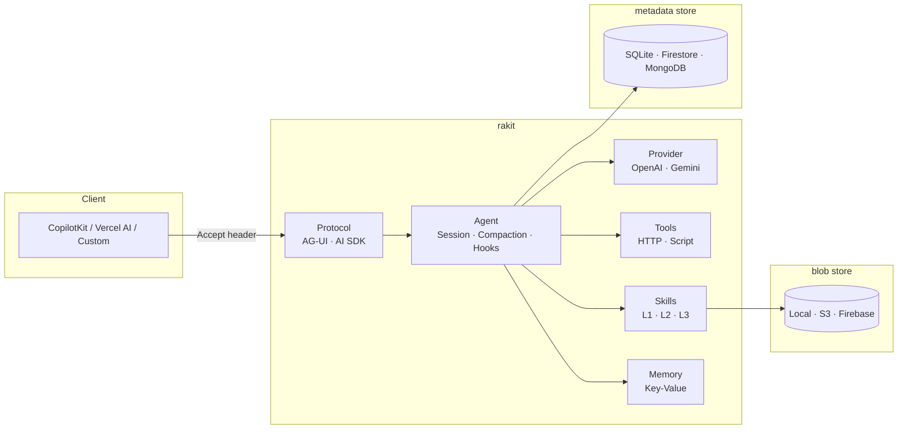
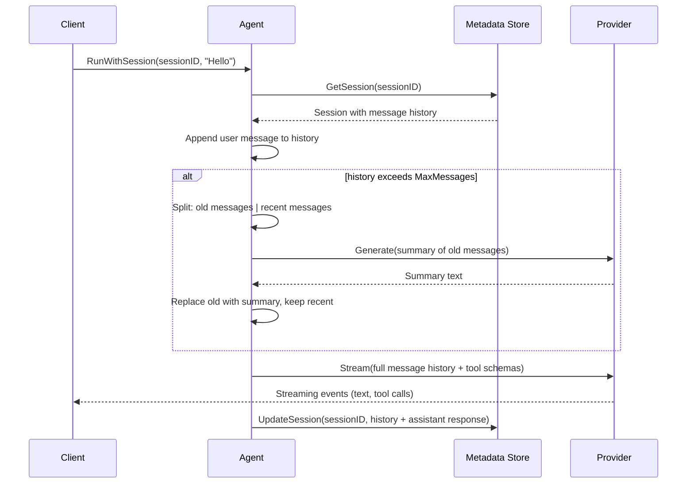
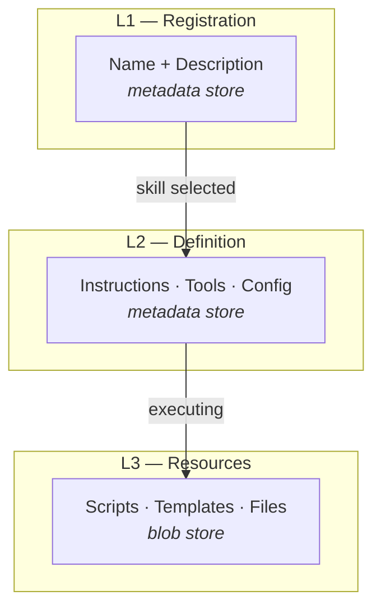
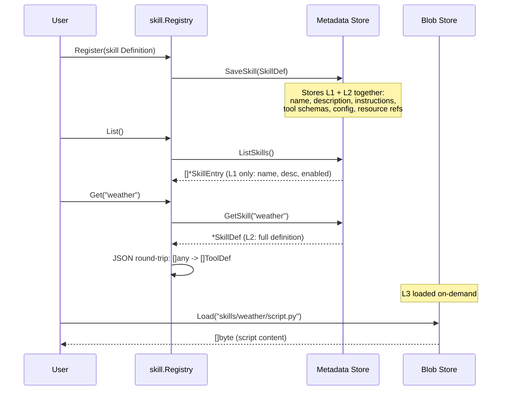
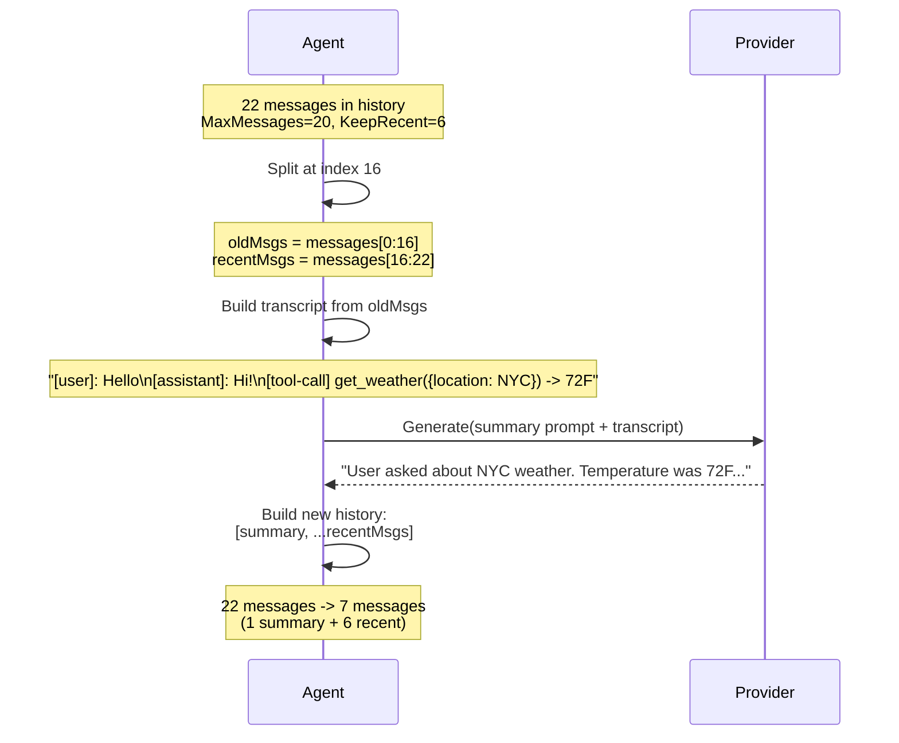

# rakit Architecture

## How It Works

rakit is an agent framework built around a simple idea: **every layer is an interface, every flow is streaming, everything is persisted**.



---

## Module: Agent

The Agent is the orchestrator. It wires together a provider, a protocol, tools, skills, a metadata store, and a blob store.

```go
type Agent struct {
    ID         string
    Provider   provider.Provider
    Protocol   protocol.Protocol
    Tools      *tool.Registry
    Skills     *skill.Registry
    Store      metadata.Store
    FS         blob.BlobStore
}
```

### Three run modes

| Method | Persistence | Compaction | When to use |
|--------|------------|------------|-------------|
| `Run` | No | No | Stateless single-turn |
| `RunWithProtocol` | No | No | Stateless with custom protocol |
| `RunWithSession` | Yes | Yes | Multi-turn conversations |

### RunWithSession flow

Every call to `RunWithSession(sessionID, input, protocol)` follows this sequence:



1. **Load** the session from the metadata store (all previous messages)
2. **Append** the new user message
3. **Compact** if history exceeds the threshold (see Compaction below)
4. **Stream** from the LLM provider with full context
5. **Save** the assistant's response back to the session

---

## Module: Protocol

Protocols define how events are serialized to the client. Two are built in:

| | AG-UI (CopilotKit) | AI SDK (Vercel) |
|---|---|---|
| Content-Type | `text/event-stream` | `text/plain; charset=utf-8` |
| Event types | 20+ (lifecycle, state, reasoning) | ~5 (simple streaming) |
| State sync | Snapshot + JSON Patch | No |
| Tool streaming | Start -> Args -> End | Single event |
| Reasoning | Full lifecycle events | No |

### Content negotiation

The registry picks the right protocol from the client's `Accept` header:

```go
reg := protocol.NewRegistry()
reg.Register(agui.New())
reg.Register(aisdk.New())

p := reg.Negotiate(r.Header.Get("Accept"))
// "text/vnd.ag-ui" -> AG-UI
// "text/vnd.ai-sdk" -> AI SDK
// default           -> AI SDK
```

One agent serves any frontend.

---

## Module: Provider

Providers are LLM backends. Both implement the same interface:

```go
type Provider interface {
    Name() string
    Model() string
    Models() []string
    Stream(ctx context.Context, req *Request) (<-chan Event, error)
    Generate(ctx context.Context, req *Request) (*Response, error)
}
```

| Provider | Models |
|----------|--------|
| OpenAI | `gpt-5.4`, `gpt-5.4-mini`, `gpt-5.4-nano` |
| Gemini | `gemini-3.1-pro-preview`, `gemini-3.1-flash-lite-preview` |

The model is selected at construction time:

```go
p := openai.New("gpt-5.4", apiKey)
```

`Stream` is used for agent runs (real-time token flow). `Generate` is used internally for compaction summarization.

---

## Module: Tool

Tools are capabilities the LLM can invoke during a run. Each tool has a name, description, JSON Schema for parameters, and an execute function.

### Interface

```go
type Tool interface {
    Name() string
    Description() string
    Parameters() any
    Execute(ctx context.Context, input map[string]any) (*Result, error)
}
```

### Result with metadata

Every tool execution returns a `Result` with standard metadata:

```go
type Result struct {
    Data       any    // custom payload (string, map, struct...)
    Status     string // "success", "error", "partial"
    Error      string // error message when failed
    Duration   int64  // execution time in ms (auto-filled by Measure)
    ExecutedAt int64  // unix millis timestamp (auto-filled)
    Fix        string // recommendation when execution fails
}
```

Helpers:

```go
// Auto-fills ExecutedAt
tool.Ok(data)

// Error with fix recommendation
tool.Err("connection refused", "Check that the service is running")

// Wraps a function, auto-fills Duration and ExecutedAt
tool.Measure(func() (*tool.Result, error) { ... })
```

### How tools get to the LLM

The `tool.Registry` holds tools in memory. When the agent calls the provider, `Schema()` converts them to the provider's tool format:

```
tool.Registry                    provider.Request
┌──────────────┐                 ┌──────────────┐
│ HTTPTool     │  ── Schema() ──>│ Tools: []    │
│ ScriptTool   │                 │ {name, desc, │
│ CustomTool   │                 │  parameters} │
└──────────────┘                 └──────────────┘
```

### Tool persistence

Tool definitions are persisted in the metadata store via `SaveTool` / `GetTool` / `ListTools`. This lets you register tools once and have them survive server restarts. The `ToolDef` stored in metadata is the schema; the `Tool` interface is the runtime execution.

### Built-in handlers

**HTTPTool** — calls an HTTP endpoint with the tool input as JSON body. Supports input field mapping (`InputMapping`) and custom headers.

**ScriptTool** — loads a script from the blob store (L3 resource) and executes it. Currently a placeholder for WASM/sandbox execution.

---

## Module: Skill

Skills are declarative agent capabilities organized in three layers for lazy loading:



| Layer | What | Where | Loaded When |
|-------|------|-------|-------------|
| **L1** Registration | Name, description, version, enabled flag | Metadata store | Skill listing (lightweight) |
| **L2** Prompt | Instructions, tool definitions, config | Metadata store | Skill activation for a run |
| **L3** Resources | Scripts, templates, binary files | Blob store | On-demand during execution |

### Why three layers?

Loading a full skill definition with all its tools and resources for every request is wasteful. The 3-layer design ensures:

- **L1** is always loaded (just a name + description) to decide which skills are available
- **L2** is loaded only when a skill is activated for a run (instructions + tool schemas)
- **L3** is loaded on-demand (a script file is only read when the tool actually executes)

### How skills are persisted



- `Register()` saves the full definition as a `SkillDef` to the metadata store
- `List()` returns lightweight `SkillEntry` records (L1) for skill selection
- `Get()` loads the full `SkillDef` (L2) and converts tool definitions into executable `Tool` interfaces
- Resources (L3) are loaded from the blob store only when a tool executes

### Enable / Disable

Skills can be toggled without removing them:

```go
a.Skills.Disable(ctx, "weather")  // keeps definition, marks enabled=false
a.Skills.Enable(ctx, "weather")   // re-enables without re-registering
```

Disabled skills don't appear in `List()` results (filtered by `Enabled` flag).

---

## Module: Compaction

Long conversations hit context window limits. Compaction solves this by summarizing older messages into a single system message, keeping recent messages verbatim.

### When it triggers

```go
func shouldCompact(msgs []Message, cfg CompactionConfig) bool {
    if len(msgs) <= cfg.KeepRecent {
        return false
    }
    return len(msgs) > cfg.MaxMessages
}
```

Default config:

| Setting | Default | Meaning |
|---------|---------|---------|
| `MaxMessages` | 20 | Trigger compaction above this count |
| `KeepRecent` | 6 | Always preserve the last N messages |
| `SummaryRole` | "system" | Role of the generated summary message |

### How it works



1. The agent splits message history: old messages (to summarize) and recent messages (to keep)
2. Old messages are formatted as a transcript with roles, content, and tool call results
3. The provider generates a concise summary via `Generate()` (non-streaming)
4. The summary replaces old messages; recent messages are preserved verbatim

### Summarization prompt

The LLM is asked to preserve:
- Key facts, decisions, and preferences the user has stated
- Important context needed for the conversation to continue naturally
- Any pending tasks or open questions

### Failure handling

Compaction is **non-blocking**. If the summarization call fails, the agent logs the error and continues with the full uncompacted history. The user's request is never blocked by a compaction failure.

---

## Module: Memory

A simple key-value store backed by the metadata adapter. Use it for agent facts, user preferences, or any persistent state across sessions.

```go
// Store a value
a.Store.Set(ctx, "user:timezone", []byte("UTC-5"))

// Retrieve it
value, _ := a.Store.Get(ctx, "user:timezone")

// List by prefix
keys, _ := a.Store.List(ctx, "user:")
// → ["user:timezone", "user:language", "user:theme"]
```

The memory namespace is flat — use key prefixes (like `user:`, `agent:`, `session:`) to organize.

---

## Module: Storage

All persistence flows through two interfaces:

### Metadata Store

```go
type Store interface {
    // Sessions
    CreateSession(ctx, agentID) (*Session, error)
    GetSession(ctx, id)        (*Session, error)
    UpdateSession(ctx, s)      error
    DeleteSession(ctx, id)      error

    // Tools
    SaveTool(ctx, tool)        error
    GetTool(ctx, name)         (*ToolDef, error)
    ListTools(ctx, agentID)    ([]*ToolDef, error)
    DeleteTool(ctx, name)      error

    // Skills
    SaveSkill(ctx, def)        error
    GetSkill(ctx, name)        (*SkillDef, error)
    ListSkills(ctx)            ([]*SkillEntry, error)
    DeleteSkill(ctx, name)     error

    // Memory (key-value)
    Set(ctx, key, value)       error
    Get(ctx, key)              ([]byte, error)
    Delete(ctx, key)           error
    List(ctx, prefix)          ([]string, error)
}
```

| Adapter | Import | Environment |
|---------|--------|-------------|
| SQLite | `storage/metadata/sqlite` | Local dev (no external services) |
| Firestore | `storage/metadata/firestore` | GCP production |
| MongoDB | `storage/metadata/mongo` | Multi-cloud production |

Not-found returns `nil, nil` (no error) across all adapters.

### Blob Store

```go
type BlobStore interface {
    Read(ctx, path)    ([]byte, error)
    Write(ctx, path, data) error
    Delete(ctx, path)  error
    List(ctx, prefix)  ([]string, error)
}
```

| Adapter | Import | Environment |
|---------|--------|-------------|
| Local FS | `storage/blob/local` | Local dev |
| S3 | `storage/blob/s3` | AWS, MinIO, Cloudflare R2 |
| Firebase | `storage/blob/firebase` | GCP production |

### What goes where

| Data | Metadata Store | Blob Store |
|------|---------------|------------|
| Session messages | Yes | |
| Tool definitions | Yes | |
| Skill definitions (L1 + L2) | Yes | |
| Skill resources (L3: scripts, files) | | Yes |
| Key-value memory | Yes | |
| Agent workspace artifacts | | Yes |

---

## Package Structure

```
github.com/ratrektlabs/rakit
├── agent/          # Agent runtime, runner, compaction, hooks
├── provider/       # Provider interface + OpenAI, Gemini
├── protocol/       # Protocol interface + AG-UI, AI SDK, registry
├── tool/           # Tool interface, Result, Registry
├── skill/          # 3-layer skill system, handlers, resources
├── storage/
│   ├── metadata/   # Store interface + SQLite, Firestore, MongoDB
│   └── blob/       # BlobStore interface + local, S3, Firebase
└── examples/
    ├── local/      # Local dev server (SQLite + local FS)
    └── cloud-run/  # Cloud Run deployment (MongoDB + S3)
```
