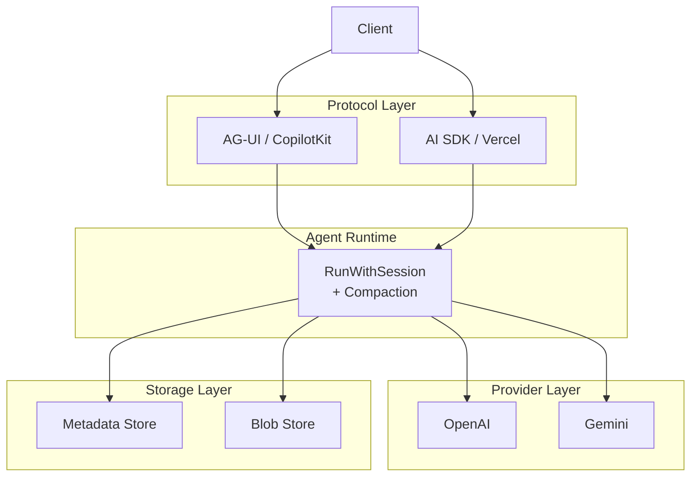
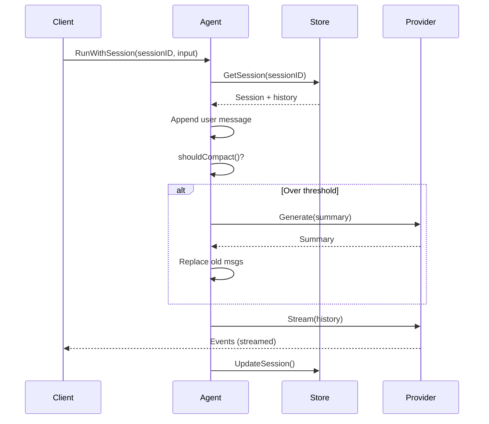

# rakit Architecture

## Overview



## Run Modes

| Method | Session | Compaction | Use Case |
|--------|---------|------------|----------|
| `Run` | No | No | Stateless single-turn |
| `RunWithProtocol` | No | No | Stateless with custom protocol |
| `RunWithSession` | Yes | Yes | Multi-turn with persistence |

### Session Flow



## Package Structure

```
github.com/ratrektlabs/rakit
├── agent/          # Agent runtime, runner, compaction, hooks
├── provider/       # Provider interface + OpenAI, Gemini
├── protocol/       # Protocol interface + AG-UI, AI SDK, registry
├── tool/           # Tool interface + registry
├── skill/          # 3-layer skill system
├── storage/
│   ├── metadata/   # Store interface + SQLite, Firestore, MongoDB
│   └── blob/       # BlobStore interface + local, S3, Firebase
└── examples/       # local (SQLite), cloud-run (MongoDB + S3)
```

## Storage

| Type | Interface | Adapters |
|------|-----------|----------|
| Metadata | Sessions, tools, skills, memory (KV) | SQLite, Firestore, MongoDB |
| Blob | Read, Write, Delete, List | Local FS, S3, Firebase Storage |
