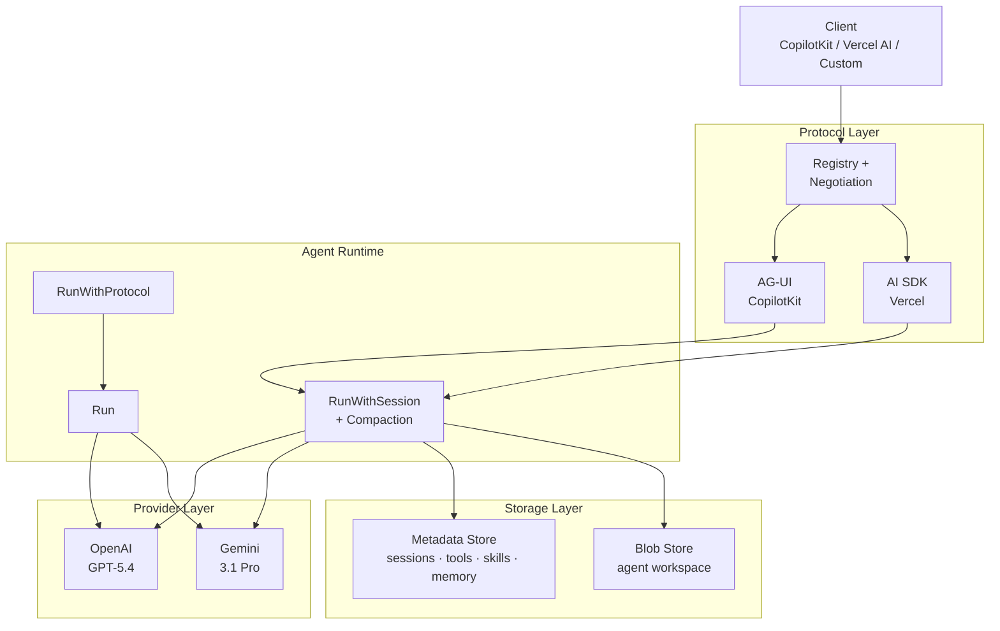
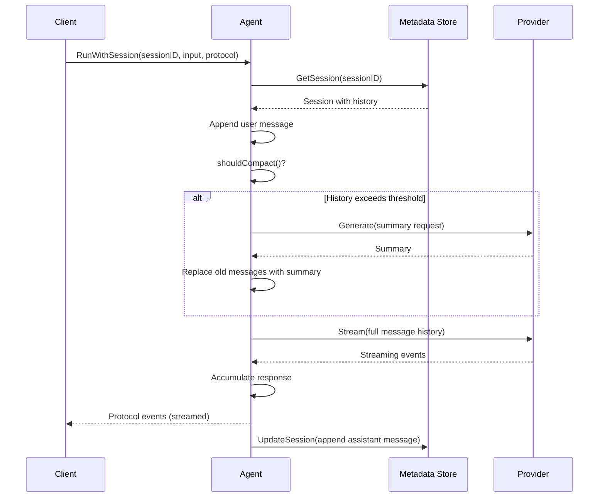
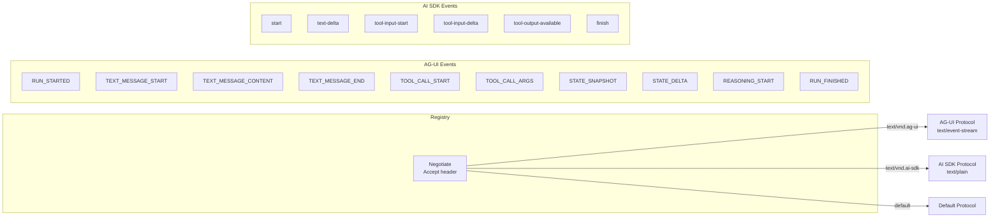
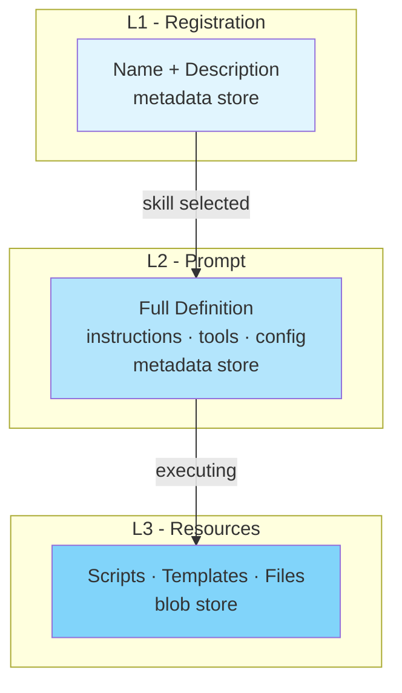

# rakit Architecture

## Overview



## Run Modes

| Method | Session | Compaction | Use Case |
|--------|---------|------------|----------|
| `Run` | No | No | Stateless single-turn |
| `RunWithProtocol` | No | No | Stateless with custom protocol |
| `RunWithSession` | Yes | Yes | Full multi-turn with persistence |

### RunWithSession Flow



## Protocol Layer



| Feature | AG-UI | AI SDK |
|---------|-------|--------|
| Source | CopilotKit (open spec) | Vercel AI SDK |
| Transport | SSE / WebSocket | SSE |
| Event types | 20+ | ~5 |
| State sync | Snapshot + JSON Patch | No |
| Tool streaming | Start → Args → End | Single event |
| Reasoning | Yes | No |
| Best for | Rich agent UIs | Simple chat |

## Provider Layer

```go
type Provider interface {
    Name() string
    Model() string
    Models() []string
    Stream(ctx context.Context, req *Request) (<-chan Event, error)
    Generate(ctx context.Context, req *Request) (*Response, error)
}
```

| Provider | Models |
|----------|--------|
| OpenAI | `gpt-5.4`, `gpt-5.4-mini`, `gpt-5.4-nano` |
| Gemini | `gemini-3.1-pro-preview`, `gemini-3.1-flash-lite-preview` |

Model is selected at construction time: `openai.New("gpt-5.4", apiKey)`.

## Skill System (3-Layer)



| Layer | What | Where | When |
|-------|------|-------|------|
| L1 | Name + description | Metadata store | Skill listing |
| L2 | Full definition (instructions, tools, config) | Metadata store | Skill activation |
| L3 | Scripts, templates, files | Blob store | On-demand execution |

## Compaction

When a session's message history exceeds `MaxMessages` (default: 20), the agent uses the LLM to summarize older messages into a single system message. The most recent `KeepRecent` (default: 6) messages are preserved verbatim.

```go
agent.WithCompaction(agent.CompactionConfig{
    MaxMessages: 20,
    KeepRecent:  6,
    SummaryRole: "system",
})
```

Compaction is non-blocking — if summarization fails, the run continues with full history.

## Storage Layer

### Metadata Store

```go
type Store interface {
    // Sessions
    CreateSession(ctx, agentID) (*Session, error)
    GetSession(ctx, id) (*Session, error)
    UpdateSession(ctx, s *Session) error
    DeleteSession(ctx, id) error

    // Tools
    SaveTool(ctx, tool *ToolDef) error
    GetTool(ctx, name) (*ToolDef, error)
    ListTools(ctx, agentID) ([]*ToolDef, error)
    DeleteTool(ctx, name) error

    // Skills
    SaveSkill(ctx, def *SkillDef) error
    GetSkill(ctx, name) (*SkillDef, error)
    ListSkills(ctx) ([]*SkillEntry, error)
    DeleteSkill(ctx, name) error

    // Memory (key-value)
    Set(ctx, key, value) error
    Get(ctx, key) ([]byte, error)
    Delete(ctx, key) error
    List(ctx, prefix) ([]string, error)
}
```

| Adapter | Import | Environment |
|---------|--------|-------------|
| SQLite | `storage/metadata/sqlite` | Local dev |
| Firestore | `storage/metadata/firestore` | GCP |
| MongoDB | `storage/metadata/mongo` | Multi-cloud |

### Blob Store

```go
type BlobStore interface {
    Read(ctx, path) ([]byte, error)
    Write(ctx, path, data) error
    Delete(ctx, path) error
    List(ctx, prefix) ([]string, error)
}
```

| Adapter | Import | Environment |
|---------|--------|-------------|
| Local FS | `storage/blob/local` | Local dev |
| S3 | `storage/blob/s3` | AWS, MinIO, R2 |
| Firebase | `storage/blob/firebase` | GCP |

## Package Structure

```
github.com/ratrektlabs/rakit
├── agent/
│   ├── agent.go          # Agent struct + options
│   ├── runner.go         # Run / RunWithProtocol / RunWithSession
│   ├── compaction.go     # LLM summarization + message conversion
│   └── hook.go           # Observability hooks
├── provider/
│   ├── provider.go       # Provider interface + types
│   ├── openai/
│   │   └── provider.go
│   └── gemini/
│       └── provider.go
├── protocol/
│   ├── protocol.go       # Protocol interface + event types
│   ├── registry.go       # Protocol registry + negotiation
│   ├── agui/
│   │   └── protocol.go   # AG-UI (CopilotKit)
│   └── aisdk/
│       └── protocol.go   # AI SDK (Vercel)
├── tool/
│   ├── tool.go           # Tool interface
│   └── registry.go       # Tool registry
├── skill/
│   ├── skill.go          # Types: Entry, Definition, ToolDef, Resource
│   ├── registry.go       # L1 Registry (metadata store)
│   ├── loader.go         # L2 Loader (full definition)
│   ├── resources.go      # L3 ResourceManager (blob store)
│   └── handlers.go       # HTTPTool, ScriptTool
├── storage/
│   ├── metadata/
│   │   ├── metadata.go   # Store interface + types
│   │   ├── sqlite/
│   │   ├── firestore/
│   │   └── mongo/
│   └── blob/
│       ├── blob.go       # BlobStore interface
│       ├── local/
│       ├── s3/
│       └── firebase/
└── examples/
    ├── local/            # Local dev server (SQLite + local FS)
    └── cloud-run/        # Cloud Run deployment (MongoDB + S3)
```
